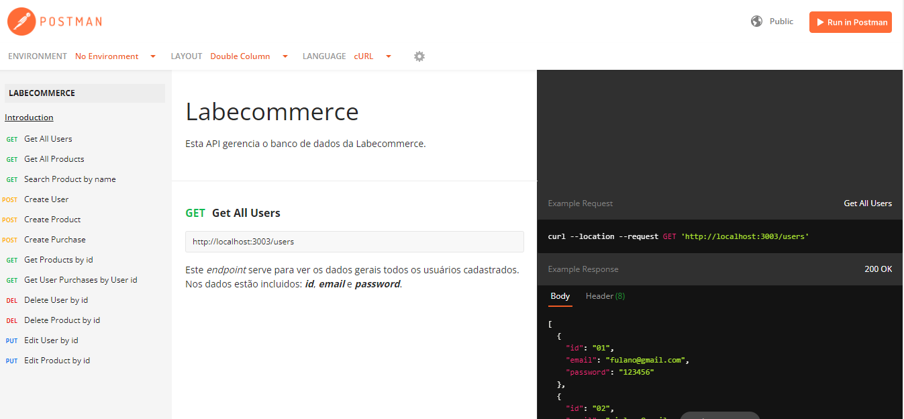

# labecommerce-backend

API desenvolvida para o Projeto Labecommerce.

Esta API gerencia um banco de dados e permite cadastrar, editar, consultar e deletar usuários e produtos.

[API Labecommerce](https://documenter.getpostman.com/view/24460902/2s8ZDU64ZF)

## 💻 Layout

